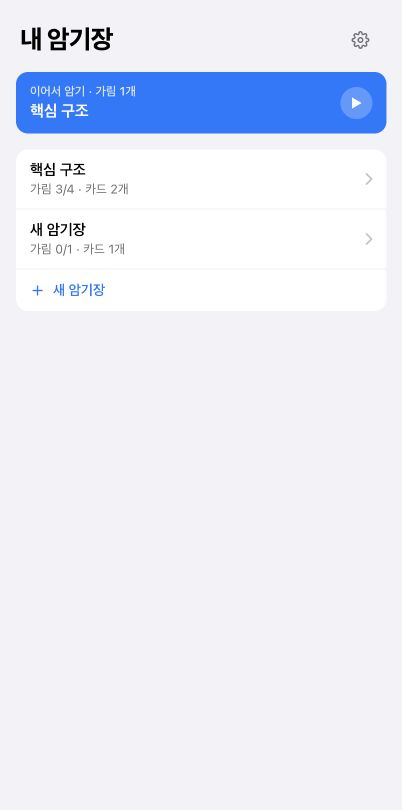
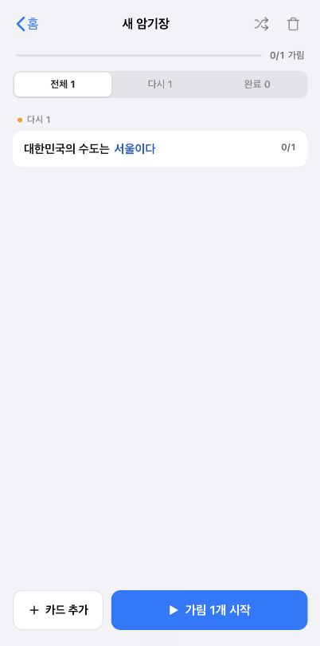
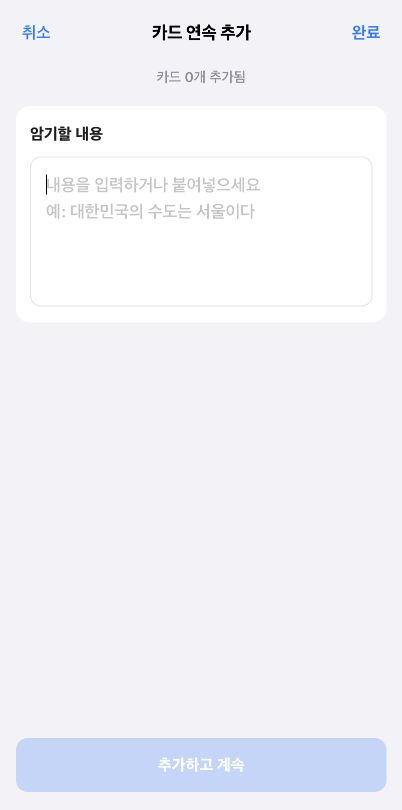
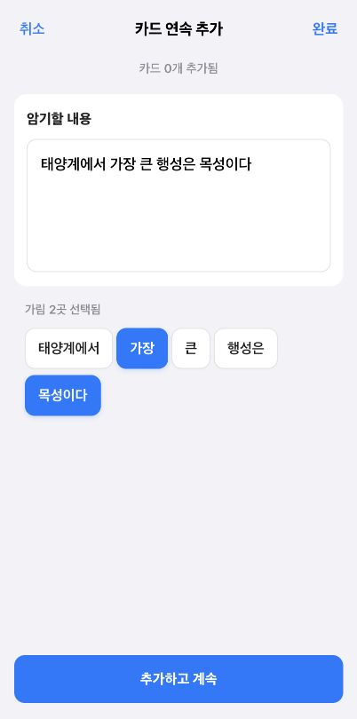
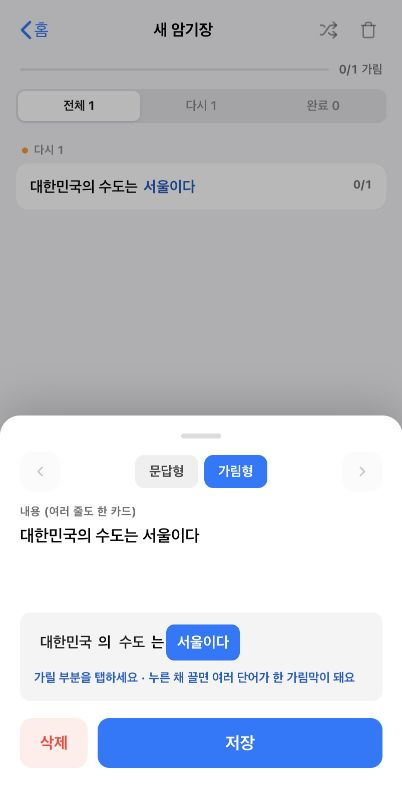
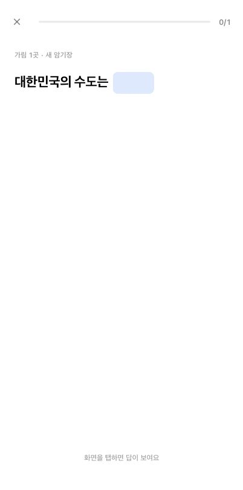
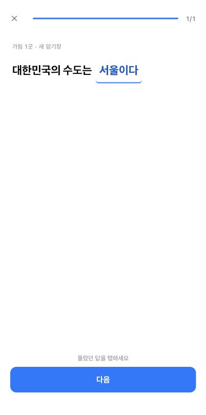
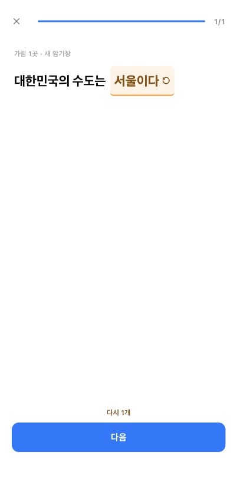

# 선택 상태와 행동 명확성 UX 감사

## 감사 범위

- 암기장 생성과 생성 직후 상태
- 카드 추가와 가림 선택
- 기존 카드 수정
- 암기 학습과 가림별 판정

사용자가 화면을 읽는 기준은 다음 다섯 가지로 고정했다.

1. 지금 무슨 상황인지 바로 보이는가
2. 지금 무엇을 해야 하는지 명확한가
3. 누르기 전에 결과를 예측할 수 있는가
4. 설명문을 없애거나 행동 가이드로 바꿀 수 있는가
5. 불필요한 선택과 AI slop이 없는가

## 전체 판정

카드 추가의 가림 선택과 학습 후 `다시` 선택은 시각적으로 비교적 명확하다. 그러나 암기장 생성과 카드 추가 종료 방식이 겹치고, 카드 수정에는 명시적인 닫기 수단과 실제 버튼 의미가 부족하다. 중요한 CTA 중 일부는 눌림 반응도 없다. 현재 가장 큰 문제는 디자인 스타일이 아니라 **같은 화면의 버튼들이 서로 다른 결과를 예측하게 만들거나, 같은 결과를 두 버튼으로 중복 제공하는 것**이다.

## 1. 암기장 생성 진입 — 주의 필요

### 확인된 장점

- 기존 암기장, 이어서 학습, 새 암기장 진입의 위계는 분명하다.
- 한 화면에서 선택해야 할 주 행동 수가 많지 않다.

### 문제

- `+ 새 암기장`을 누르면 이름이나 생성 확인 없이 즉시 `새 암기장`이 저장되고 카드 추가 화면으로 이동한다.
- 카드 추가 화면에서 취소해도 빈 암기장이 남는다. 사용자는 `새 암기장`이 생성 버튼인지, 작성 흐름의 시작 버튼인지 누르기 전에 예측하기 어렵다.
- 생성 실패나 처리 중 상태가 버튼 자체에 드러나지 않는다.

### 권장 수정

- 암기장을 즉시 저장하지 말고 작성 중인 draft로 연다.
- 첫 카드가 실제로 추가될 때 암기장을 생성한다.
- 카드 없이 취소하면 홈으로 돌아가며 아무것도 남기지 않는다.
- 생성 CTA는 눌린 동안 scale 또는 밝기 반응을 공통으로 제공한다.

## 2. 암기장과 카드 목록 — 양호, 상태 체계 보완 필요

### 확인된 장점

- `0/1 가림`, `다시 1`, 카드별 `0/1`이 같은 가림 단위 상태를 전달한다.
- 하단 CTA가 `가림 1개 시작`으로 결과를 예고한다.
- 전체/다시/완료 탭의 선택 상태는 흰 배경과 그림자로 구분된다.

### 문제

- 선택되지 않은 필터의 회색 텍스트와 비활성 필터 `완료 0`이 비슷해, 누를 수 있는 탭인지 불가능한 탭인지 즉시 구분되지 않는다. 실제로 `완료 0`은 누를 수 있지만 결과는 빈 화면이다.
- `섞기`는 선택 가능 토글이지만 기본 아이콘 상태만으로는 현재 켜짐/꺼짐을 빠르게 알기 어렵다.
- 카드 행은 수정 진입점이지만 별도 affordance가 없어, 처음 보는 사용자는 눌러서 수정된다는 사실을 예측하기 어렵다.
- `카드 추가`와 `가림 시작`은 중요한 버튼이지만 공통 `.ui-button`에는 눌림 반응이 없다.

### 권장 수정

- 0개 필터는 disabled 처리하거나 아예 숨긴다. 보이면 반드시 누를 가치가 있어야 한다.
- 섞기 활성 시 아이콘 배경 또는 색 면을 유지해 토글 상태를 명확히 한다.
- 카드 행 끝에 작은 편집 아이콘을 두거나, 탭 시 수정됨을 암시하는 명확한 행 스타일을 사용한다.
- 모든 주요 CTA에 동일한 pressed 상태를 적용한다.

## 3. 카드 추가 초기 상태 — 개선 필요

### 확인된 장점

- 입력 필드 하나에 집중되어 지금 해야 할 행동은 명확하다.
- `추가하고 계속`의 비활성 상태는 색 차이와 disabled 속성으로 전달된다.

### 문제

- 카드가 0개일 때 `취소`와 `완료`가 모두 같은 화면 닫기 동작을 한다. 선택 피로만 늘어난다.
- 카드를 이미 추가한 뒤에도 `취소`라는 문구가 남아, 앞에서 추가한 카드까지 취소될 것처럼 보이지만 실제로는 유지된다.
- 상단 `카드 0개 추가됨`은 초기에는 정보 가치가 거의 없고 화면의 설명 밀도만 높인다.
- 입력 예시는 유용하지만, placeholder에 행동 지시와 예시가 함께 들어가 있어 다소 길다.

### 권장 수정

- 상단 왼쪽은 항상 `닫기`, 오른쪽 `완료`는 제거한다.
- 한 장 이상 추가한 뒤에는 왼쪽을 `암기장으로`로 바꾸거나, 하단 보조 행동으로 제공한다.
- `0개 추가됨`은 숨기고 첫 추가 이후에만 `1개 추가됨` 상태를 표시한다.
- placeholder는 짧은 예시만 남긴다.

## 4. 카드 추가 선택 상태 — 양호

### 확인된 장점

- 선택한 단어는 파란 면, 흰 글자, 그림자로 선택되지 않은 단어와 확실히 구분된다.
- `가림 2곳 선택됨`과 활성화된 `추가하고 계속`이 선택 결과를 즉시 확인시킨다.
- 단어 자체를 눌러 선택하므로 별도 체크박스나 설명이 필요 없다.

### 보완점

- 선택 토큰과 주요 CTA는 눌렀을 때 scale/밝기 반응이 일관돼야 한다.
- `가림 2곳 선택됨`은 상태 확인에는 유용하지만, 선택 색이 충분히 명확하므로 모바일에서는 `2곳 선택` 정도로 줄일 수 있다.

## 5. 카드 수정 — 우선 개선 필요

### 확인된 장점

- `문답형 / 가림형` 선택 상태는 파란 면으로 명확하다.
- 선택된 가림도 파란 면으로 분명하다.
- 저장 CTA의 우선순위는 높게 보인다.

### 문제

- 패널에 `닫기`나 `취소`가 없다. 배경을 탭하면 닫히지만 사용자가 미리 알 수 없고, 수정한 내용이 저장되는지 버려지는지도 예측하기 어렵다.
- 이전/다음 화살표는 카드가 하나뿐이어도 남아 있다. 매우 흐려 보이지만 실제 disabled 속성과 버튼 의미가 없는 `div`다.
- `삭제`와 `저장`도 실제 button이 아닌 `div`여서 키보드 포커스와 버튼 의미가 없다.
- `내용 (여러 줄도 한 카드)`와 `가릴 부분을 탭하세요 · 누른 채 끌면 여러 단어가 한 가림막이 돼요`는 설명식 문구가 한 화면에 겹친다.
- 삭제와 저장 모두 눌림 반응이 없다.

### 권장 수정

- 상단에 명시적인 `닫기`를 둔다. 수정 발생 시 `변경사항 버리기 / 계속 수정`만 그때 확인한다.
- 이전/다음 대상이 없으면 화살표를 숨긴다. 대상이 있을 때만 실제 button으로 표시한다.
- 삭제와 저장을 실제 button으로 바꾸고 focus-visible, disabled, pressed 상태를 제공한다.
- 설명은 행동 가이드 `가릴 답을 탭하세요` 하나로 줄인다. 드래그 안내는 사용자가 길게 누르기 시작했을 때만 보조 피드백으로 노출한다.

## 6. 암기 시작과 답 공개 — 양호

### 확인된 장점

- 가림막, 진행률 `0/1`, 하단 행동 가이드가 현재 상황과 다음 행동을 연결한다.
- 불필요한 판정 버튼이 답 공개 전에 나타나지 않는다.

### 보완점

- 전체 화면이 탭 대상이라는 사실은 문구에 의존한다. 가림막 자체에 아주 약한 눌림/호버 반응을 주면 문구를 더 줄일 수 있다.
- 화면 탭과 가림막 탭 중 실제 타깃 범위를 시각적으로는 알기 어렵다.

## 7. 학습 판정 전 상태 — 개선 필요

### 문제

- 답이 공개되자마자 파란색과 밑줄로 표시된다. 카드 추가 화면에서 파란 면이 `선택됨`을 뜻하기 때문에, 여기서도 이미 선택된 상태처럼 읽힐 수 있다.
- `다음` 버튼은 활성화되어 있지만, 그대로 누르면 이 답이 ‘앎’으로 처리된다는 결과가 버튼 자체에는 드러나지 않는다.

### 권장 수정

- 공개된 기본 답은 검정 또는 중립색으로 표시한다.
- 선택 가능한 답임을 얇은 테두리 또는 가벼운 배경으로만 나타낸다.
- `몰랐던 답을 탭하세요`는 유지 가능한 행동 가이드다.

## 8. 학습 판정 선택 상태 — 양호, 결과 예측 보완

### 확인된 장점

- 주황 배경, 밑줄, 되돌리기 아이콘, `다시 1개`가 선택 상태를 여러 방식으로 확인시킨다.
- 선택 해제가 가능한 버튼이며 접근성 트리에서도 pressed 상태가 전달된다.

### 보완점

- `다음` CTA만 보면 선택 결과를 알 수 없다. `다음 · 다시 1개`처럼 결과를 CTA에 합치면 하단 상태 문구를 없앨 수 있다.
- 선택 전/후 상태 모두 같은 CTA 색이므로, 변화가 답 영역에만 몰려 있다.

## 가장 먼저 바꿀 것

1. 새 암기장을 draft로 만들고, 첫 카드 추가 전 취소 시 아무것도 남기지 않는다.
2. 카드 추가의 `취소 / 완료` 중복을 하나의 명확한 종료 행동으로 합친다.
3. 카드 수정에 닫기와 변경사항 처리 규칙을 노출하고, div 버튼을 실제 button으로 교체한다.
4. 모든 중요 CTA에 공통 pressed 반응을 적용한다.
5. 학습 판정의 기본 답을 중립색으로 바꾸고, `다음`에 결과를 함께 표시한다.

## 접근성 위험과 확인 한계

- 스크린샷과 현재 DOM에서 카드 수정의 화살표, 삭제, 저장이 실제 버튼으로 노출되지 않는 것을 확인했다.
- 텍스트 입력은 CSS에서 기본 outline이 제거되어 있어 키보드 포커스 위치가 보이지 않을 가능성이 높다.
- 색 대비 수치, 스크린리더 전체 읽기 순서, 확대/리플로우, reduced-motion 대응은 이번 모바일 화면 캡처만으로 완전하게 확인하지 않았다.
- 실제 터치 장치의 햅틱과 아주 짧은 pressed 애니메이션은 정지 스크린샷만으로 판단할 수 없어 코드의 상태 스타일도 함께 확인했다.
